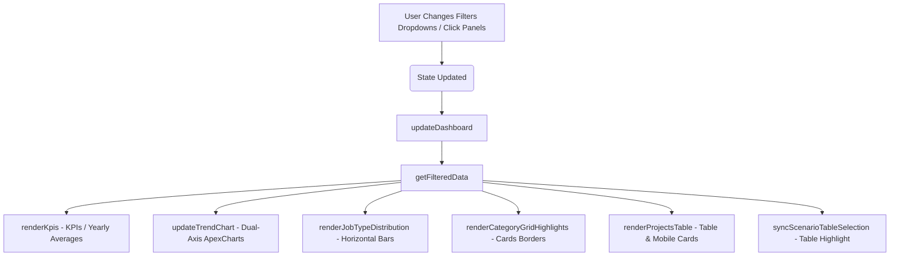

# คู่มือประกอบระบบแดชบอร์ดงบซ่อม CCTV เทศบาลนครนครสวรรค์
### CCTV Repair Budget Dashboard | Nakhon Sawan Municipality

เอกสารฉบับนี้เป็นคู่มือประกอบระบบและคำอธิบายทางเทคนิคสำหรับการพัฒนาและติดตั้งแอปพลิเคชันแดชบอร์ดงบซ่อมกล้องวงจรปิด (CCTV) ย้อนหลัง 3 ปี (พ.ศ. 2567 - 2569) ของเทศบาลนครนครสวรรค์ ซึ่งพัฒนาขึ้นเพื่อทดแทนอินโฟกราฟิกแบบภาพนิ่ง ให้เป็นแอปพลิเคชันเว็บแบบ Single Page Application (SPA) ที่โต้ตอบได้อย่างสมบูรณ์ รวดเร็ว และรองรับการทำงานในทุกอุปกรณ์ (Fully Responsive Design)

---

## 1. โครงสร้างไฟล์ในระบบ (Project Directory Structure)

โปรเจกต์ประกอบด้วยไฟล์หลัก 3 ไฟล์และโฟลเดอร์เอกสารประกอบ ซึ่งวางโครงสร้างตามมาตรฐานการพัฒนาเว็บแบบ Vanilla Stack (HTML5 / CSS3 / JavaScript):

```text
d:\cctv-Fix3Y\
├── index.html                      # ไฟล์โครงสร้างอินเทอร์เฟซหลัก (Structural Markup)
├── styles.css                      # ดีไซน์ระบบสไตล์ โทนสี และการตอบสนองหน้าจอ (Design System & CSS Grid)
├── app.js                          # ชุดข้อมูลจำลอง ตรรกะคัดกรอง และตัวควบคุมการโต้ตอบ (Reactive Logic & Charts)
├── README.md                       # เอกสารประกอบโครงการโดยละเอียด (เอกสารฉบับนี้)
└── docs/
    └── ui/
        └── responsive/
            └── responsive_guide.md  # คู่มือข้อกำหนดแนวทางการแสดงผลบนมือถือและแท็บเล็ต
```

---

## 2. โครงสร้างข้อมูลทางเทคนิค (Data Model Schema)

ระบบเก็บชุดข้อมูลโครงการจริงจำนวน **9 โครงการ** (อ้างอิงจากรายงานในคลังเก็บข้อมูลย้อนหลัง 3 ปี) ไว้ในไฟล์ `app.js` ด้วยโครงสร้างข้อมูล Object Array โดยมีโครงสร้างดังนี้:

```typescript
interface Project {
    id: number;              // รหัสภายในระบบ
    year: number;            // ปีงบประมาณ (พ.ศ. 2567, 2568, 2569)
    order: number;           // ลำดับที่ในรายงานปีนั้น ๆ
    name: string;            // ชื่อโครงการ/รายการจัดจ้างจริง
    jobtype: string;         // ประเภทงานหลัก (ใช้สำหรับจำแนกกลุ่มและแผงตัวกรอง)
    cameras: number;         // จำนวนกล้องที่เกี่ยวข้อง (0 หากไม่มี)
    poles: number;           // จำนวนเสาที่เกี่ยวข้อง (0 หากไม่มี)
    budget: number;          // งบประมาณจัดซื้อจัดจ้างจริง (บาท)
    procure: string;         // วิธีจัดซื้อจัดจ้าง (เฉพาะเจาะจง, คัดเลือก, e-bidding)
    status: string;          // สถานะโครงการ (เสร็จสิ้น, อยู่ระหว่างดำเนินการ)
    location: string;        // พิกัดพื้นที่อ้างอิง
    coords: string;          // ละติจูด, ลองจิจูดจำลองสำหรับระบบแผนที่ (GIS)
    desc: string;            // รายละเอียดขอบเขตงานโดยย่อ
    note?: string;           // หมายเหตุเพิ่มเติมจากตัวรายงานจริง
    logs: TechLog[];         // บันทึกความคืบหน้าเชิงเทคนิคและผู้รับผิดชอบงาน
    imgBefore: string;       // URL ภาพถ่ายสถานะอุปกรณ์ก่อนดำเนินการซ่อม
    imgAfter: string;        // URL ภาพถ่ายสถานะอุปกรณ์หลังดำเนินการซ่อม
}

interface TechLog {
    time: string;            // วันเวลาที่มีกิจกรรมซ่อมบำรุง
    text: string;            // กิจกรรมที่ช่างดำเนินการจริง
    tech: string;            // ชื่อช่างผู้รับผิดชอบโหนดกล้อง
}
```

### การกระจายตัวของงบประมาณและข้อมูลรวม (Project Aggregates):
ข้อมูลในโมเดลคำนวณและสรุปได้ตัวเลขสะสมรวมตรงตามเอกสารรายงานจริงของเทศบาลนครนครสวรรค์ 100%:
* **ซ่อมระบบกล้อง (4 โครงการ)**: งบรวม 1,737,000 บาท | 119 กล้อง
* **งานสายสัญญาณ/โครงข่าย และระบบไฟฟ้า (3 โครงการ)**: งบรวม 3,477,000 บาท | 275 กล้อง
* **ย้าย/เดินสายส่งสัญญาณ (1 โครงการ)**: งบรวม 163,000 บาท | 0 กล้อง
* **ติดแถบสีสายสัญญาณ (1 โครงการ)**: งบรวม 295,000 บาท | 870 เสา
* **รวมงบประมาณสะสม 3 ปี**: **5,672,000 บาท** (5.672 ล้านบาท)
* **รวมจำนวนกล้องที่ซ่อม**: **394 ตัว**
* **รวมเสาไฟฟ้าที่ติดแถบสี**: **870 ต้น**

---

## 3. สถาปัตยกรรมระบบตัวแปลงและการโต้ตอบ (Application Architecture)

แดชบอร์ดมีแนวคิดการออกแบบแบบ **Reactive State** ซึ่งหมายความว่าเมื่อ "สถานะตัวกรอง" (State) ของผู้ใช้เปลี่ยนไป ฟังก์ชันแสดงผล (Render Engine) จะทำงานใหม่เพื่อคำนวณตัวเลขและอัปเดตองค์ประกอบของหน้าเว็บโดยอัตโนมัติ:



### ฟังก์ชันสำคัญในระบบโต้ตอบ:
1. **ตัวคูณจำลองงบประมาณ (Scenario Simulator)**:
   * ดึงค่าสัมประสิทธิ์จำลองงบประมาณจาก Dropdown หรือตารางสมมติฐาน (`ฐานข้อมูล = 1.0`, `ลด 20% = 0.8`, `ลด 35% = 0.65`, `ลด 50% = 0.5`)
   * นำสัมประสิทธิ์ไปคำนวณปรับลดงบประมาณในระดับแถวโครงการโดยอัตโนมัติ ส่งผลให้ตัวเลขงบรวมและค่าเฉลี่ยในหน้าต่าง KPI ลดลงแบบเรียลไทม์
   * กราฟรายปี (ApexCharts) จะแสดงแท่งงบประมาณ "ดั้งเดิม" (สีเทา) คู่ขนานกับงบประมาณ "จำลอง" (สีน้ำเงิน) เพื่อช่วยให้ผู้ใช้เปรียบเทียบส่วนต่างที่ประหยัดได้ชัดเจน
2. **ระบบคัดกรองข้อมูลสองชั้น (Click-to-Filter Panels)**:
   * นอกจาก Dropdown ในแถบเครื่องมือหลักแล้ว ผู้ใช้สามารถ "คลิก" เลือกประเภทงานที่กล่องจำแนกประเภทรายการซ่อมตรงกลางหน้าจอ หรือแถบวิเคราะห์สัดส่วนงบด้านขวามือ เพื่อจำกัดขอบเขตการคัดกรองข้อมูลตามประเภทงานได้ทันที
3. **ระบบตรวจสอบแบบเจาะลึกโครงการ (Drill-down Detail Modal)**:
   * เมื่อผู้ใช้คลิกเลือกโครงการใดก็ตามในตารางด้านล่าง ระบบจะแสดงรายละเอียดในหน้าต่าง Modal ทับซ้อน (Overlay) เพื่อให้เห็นพิกัด GIS, บันทึกการซ่อมของช่าง, และหลักฐานภาพถ่ายเชิงลึก

---

## 4. ข้อกำหนดการตอบสนองบนมือถือ (Responsive UI Layout Specs)

สอดคล้องตามทักษะ `/ux-ui-responsive` ระบบใช้ Media Queries ในไฟล์ CSS ในการสลับหน้าตาของส่วนอินเทอร์เฟซเพื่อให้ผู้ใช้ในอุปกรณ์ขนาดพกพาสามารถอ่านรายงานได้อย่างสะดวกสบายสูงสุด:

1. **จุดตัดความกว้างหน้าจอ (Breakpoints)**:
   * `Desktop View`: ความกว้างหน้าจอมากกว่า `1200px` (แสดงผล 3 คอลัมน์)
   * `Tablet View`: ความกว้างระหว่าง `768px` ถึง `1200px` (ไหลรวมเป็น 2 หรือ 1 คอลัมน์ตามความเหมาะสม)
   * `Mobile View`: ความกว้างต่ำกว่า `768px` (ทุกพาเนลไหลเรียงในแนวตั้ง)
2. **เมนูคัดกรองพับได้ (Collapsible Filters Drawer)**:
   * บนอุปกรณ์มือถือ ตัวคัดกรอง 4 ตัวเลือกและปุ่มรีเซ็ตจะถูกซ่อนไว้ในแถบดึงความกว้างเต็มจอ (Full-width Dropdown Drawer) เพื่อป้องกันการเบียดบังพื้นที่แสดงผลกราฟ
   * ผู้ใช้เปิดใช้งานผ่านปุ่มสลับ "ตัวเลือกตัวกรอง" ที่มีไอคอนลูกศรหมุนตามแนวตั้ง
3. **ความเสถียรของกราฟ (Chart Horizontal Scroll Lock)**:
   * กราฟแสดงแนวโน้มของ ApexCharts บนมือถือจะถูกล็อคความกว้างขั้นต่ำไว้ที่ `500px` ภายในกรอบที่เลื่อนแนวนอนได้ (`overflow-x: auto`) ป้องกันตัวหนังสือและเส้นกราฟเบียดชิดจนทับซ้อนและอ่านยาก
4. **การ์ดข้อมูลทดแทนตาราง (Row-to-Card Grid Transformation)**:
   * ตารางโครงการขนาด 8 คอลัมน์จะถูกซ่อนบนจอขนาดเล็ก และระบบจะวาดการ์ดโครงการแบบกระชับ (Project Cards List) ขึ้นมาแทนที่โดยอัตโนมัติ โดยเน้นข้อมูลชื่อโครงการ ปีงบประมาณ และจำนวนเงิน ซึ่งสามารถแตะบนการ์ดเพื่อเปิด modal ได้ทันที
5. **แท็บจัดสรรงบประมาณ 3 ระยะ (Guidelines Tabbed UI)**:
   * บนอุปกรณ์มือถือ กล่องแนวทางจัดทำงบประมาณ 3 ระยะจะเปลี่ยนหน้าตาเป็นปุ่มแท็บสลับ `ระยะสั้น` | `ระยะกลาง` | `ระยะยาว` เพื่อแสดงผลเพียงทีละหัวข้อ แทนที่จะต่อกันลงไปด้านล่าง ช่วยลดปริมาณการเลื่อนหน้าจอที่ยาวเกินไป (Scroll Fatigue)

---

## 5. คู่มือการเปิดใช้งานและทดสอบระบบ (Getting Started Guide)

ผู้ควบคุมระบบหรือนักพัฒนาสามารถเปิดใช้งานแดชบอร์ดนี้ได้ทันทีผ่าน 3 วิธีดังนี้:

### วิธีที่ 1: เปิดใช้งานผ่าน Development Server (แนะนำ)
เนื่องจากระบบใช้ไลบรารี ApexCharts และ Lucide Icons ผ่าน CDN ที่ปลอดภัย ท่านสามารถรันระบบผ่านเว็บเซิร์ฟเวอร์ขนาดเล็กได้ทันที โดยพิมพ์คำสั่งใน Terminal หรือ PowerShell ภายใต้ไดเรกทอรีโปรเจกต์:
```powershell
# วิธีเปิดโดยใช้ Node.js (รันบนพอร์ต 8080)
npx http-server

# หรือเปิดโดยใช้ Python
python -m http.server 8080
```
จากนั้นเข้าชมหน้าต่างการใช้งานที่เบราว์เซอร์ผ่าน URL: **[http://localhost:8080](http://localhost:8080)**

### วิธีที่ 2: เปิดผ่านหน้าเบราว์เซอร์โดยตรง (Local File Double-Click)
เนื่องจากแอปพลิเคชันถูกเขียนขึ้นด้วยสถาปัตยกรรมสแตติกที่ไม่มีการประมวลผลหลังบ้าน (Serverless / Static Pages) ท่านสามารถทำการดับเบิ้ลคลิกที่ไฟล์ **`index.html`** ในเครื่องคอมพิวเตอร์เพื่อเปิดแดชบอร์ดบนเว็บเบราว์เซอร์ได้ทันทีโดยไม่ต้องรันเซิร์ฟเวอร์
*(หมายเหตุ: ภาพถ่าย Unsplash หรือแผนที่จำลองอาจจำเป็นต้องใช้การเชื่อมต่ออินเทอร์เน็ตสำหรับการโหลดภาพภายนอก)*

---

## 6. โทนสีและสัญลักษณ์ระบบ (Color & Visual Identity Guide)

ดีไซน์และโทนสีของแอปพลิเคชันถูกออกแบบให้ตรงตามเอกลักษณ์ของหน่วยงานเทศบาลนครนครสวรรค์และมีความพรีเมียมทันสมัย:
* **สีหลักสถาบัน (Deep Navy - #072854)**: ใช้สำหรับส่วนแถบนำทาง หัวข้อหลัก และตาราง
* **สีงบประมาณจำลอง (Accent Blue - #0ea5e9)**: ใช้แสดงแถบจำลอง Scenario และการไฮไลท์ตัวเลขที่ประหยัดได้
* **สีการประหยัดงบ (Accent Green - #10b981)**: ใช้ไฮไลท์สถานะที่ประสบผลประหยัดงบประมาณ
* **สีกราฟจำนวนกล้อง (Amber Orange - #f97316)**: ใช้สำหรับแสดงจำนวนกล้องที่เป็นเป้าหมายในการซ่อมบำรุงรักษา
